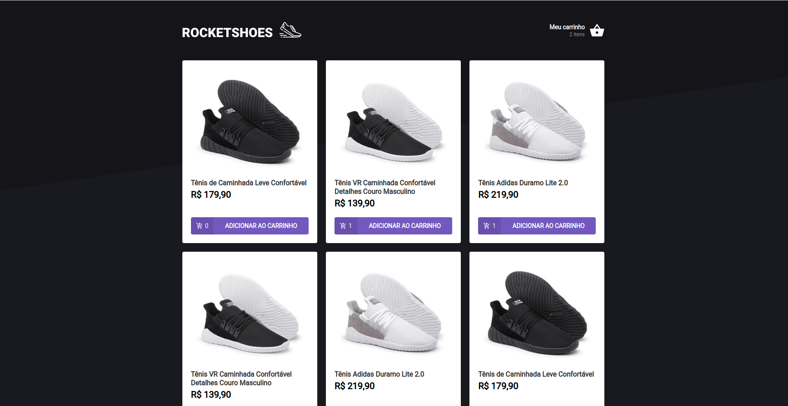

<h1 align="center" style="color:#39b656">Challange 03 Reactjs Ignite</h1>

<h4 align="center">ROCKETSHOES</h4>
<p align="center">
  
</p>

## 🛠 Tecnologias

As seguintes tecnologias foram usadas na construção do projeto:

- React
- TypeScript
- JSON Server
- LocalStorage API
- Toastify

## 🎲 Instalação

Para executar este projeto, você deve possuir o Node e o Yarn instalado para configurar todas as dependências.

```shell
- Clone o repositório:
cd "diretorio de sua preferencia"
$ git clone https://github.com/michelspirlandeli/challange-03-reactjs

- Para instalar as dependências:
$ yarn

- Execute o json server
$ yarn server

- Abra seu browser em:
http://localhost:3333/

- Execute a aplicação:
$ yarn start

- Abra seu browser em:
http://localhost:3000/
```

## ✅ Author

**Michel Spirlandeli**